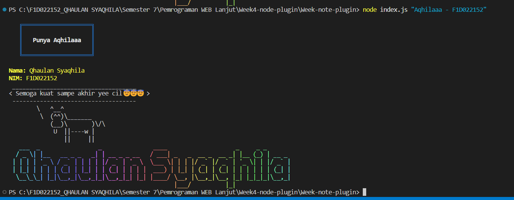

# Week4-node-plugin

Proyek ini dibuat untuk *Assignment 1 - Week 4* dengan tujuan belajar menggunakan plugin Node.js seperti chalk, cowsay, dan figlet.  
Selain itu, saya tambahin juga beberapa package tambahan (gradient-string, boxen) biar hasil di terminal makin menarik.

## 1️ Langkah-langkah Install Dependensi

- Pastikan Node.js sudah terpasang. Cek dulu versi Node.js dan npm:

  bash
  node -v
  npm -vs

  

- Clone repo ini atau download source code-nya, lalu jalankan:
  git clone https://github.com/Aqhilaaa9/Week4-node-plugin.git
  cd Week4-node-plugin

- Install semua package yang dibutuhkan:
 npm install chalk cowsay figlet gradient-string boxen

## 2 Langkah-langkah Menjalankan Proyek

Jalankan script dengan perintah: node index.js "Baiq Luthfida - F1D022067"

## 3 Langkah-langkah Menjalankan Proyek
